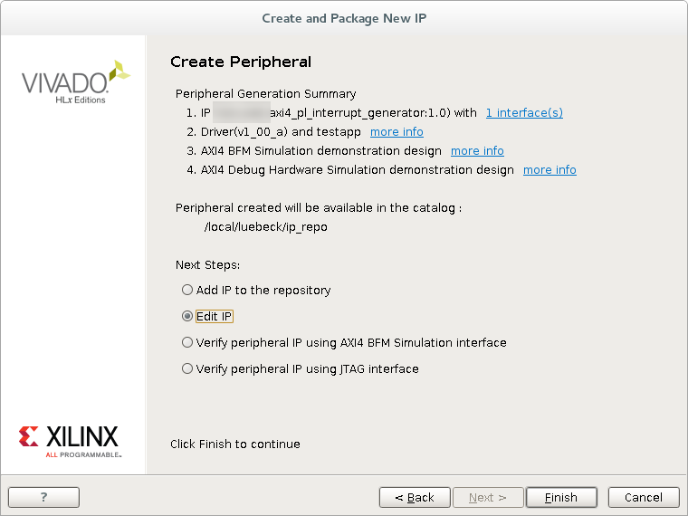

<!--
Author: Konstantin Lübeck (University of Tübingen, Chair for Embedded Systems)
-->

# Setting up a PL to PS interrupt on the Zedboard

This tutorial shows you how to setup a PL to PS interrupt on the Zedboard using Vivado and the Xilinx SDK

## Requirements

- Vivado 2016.4
- Zedboard

## Creating a New Vivado Project

This part is pretty straight forward. You can look up how to setup a new Vivado project here:

[https://github.com/k0nze/zedboard_axi4_master_burst_example#creating-a-new-vivado-project](https://github.com/k0nze/zedboard_axi4_master_burst_example#creating-a-new-vivado-project)

Thoughout this tutorial the name for the Vivado project is `pl_to_ps_interrupt_example`.

## Creating a Custom AXI IP

After you successfully created a new Vivado project do the following steps to create a custom AXI IP which will issue the interrupts from the PL to the PS with an AXI slave interface.

1. Open: _Menu -> Tools -> Create and Package IP_.

    

2. Click _Next >_

    

3. Choose _Create a new AXI4 peripheral_.

    

4. Choose a name, description and location for the new AXI4 peripheral. The name in this tutorial is `axi4_pl_interrupt_generator` and the location is `[...]/ip_repo`.

    

5. Keep the AXI4-Lite slave interface and click _Next >_

    

6. Choose _Edit IP_ and click _Finish_

    

