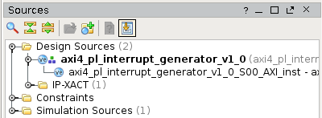
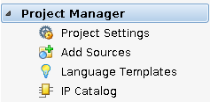
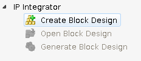
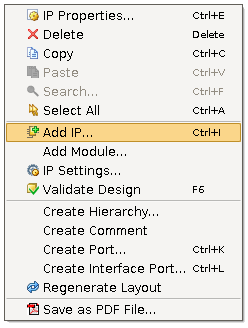

<!--
Author: Konstantin Lübeck (University of Tübingen, Chair for Embedded Systems)
-->

# Setting up a PL to PS interrupt on the Zedboard

This tutorial shows you how to setup a PL to PS interrupt on the Zedboard using Vivado and the Xilinx SDK

## Requirements

- Vivado 2016.4
- Zedboard

## Creating a New Vivado Project

This part is pretty straight forward. You can look up how to setup a new Vivado project here:

[https://github.com/k0nze/zedboard_axi4_master_burst_example#creating-a-new-vivado-project](https://github.com/k0nze/zedboard_axi4_master_burst_example#creating-a-new-vivado-project)

Thoughout this tutorial the name for the Vivado project is `pl_to_ps_interrupt_example`.

## Creating a Custom AXI4 IP

After you successfully created a new Vivado project do the following steps to create a custom AXI IP which will issue the interrupts from the PL to the PS with an AXI slave interface.

1. Open: _Menu -> Tools -> Create and Package IP_.

    


2. Click _Next >_

    


3. Choose _Create a new AXI4 peripheral_.

    


4. Choose a name, description and location for the new AXI4 peripheral. The name in this tutorial is `axi4_pl_interrupt_generator` and the location is `[...]/ip_repo`.

    


5. Keep the AXI4-Lite slave interface and click _Next >_

    


6. Choose _Edit IP_ and click _Finish_

    


## Edit AXI4 IP

After the successful creation of the new IP a new Vivado project was opened. In this project you can find the Vivado generated Verilog code for the AXI4-Lite slave and a top module (wrapper) which contains the AXI4-Lite slave.



* `axi4_pl_interrupt_generator_v1_0` contains the top module
* `axi4_pl_interrupt_generator_v1_0_S00_AXI_inst`contains the Verilog code for the AXI4-Lite slave.

The AXI4-Lite slave will be used to set and clear the interrupt from the PS.

Double-click on `axi4_pl_interrupt_generator_v1_0_S00_AXI_isnt` and navigate to the ports definition and add your own ports under `// Users to add ports here`.

```verilog
// Users to add ports here
output wire interrupt_0,
output wire interrupt_1,
// User ports ends
```

Those two wires will later be connected to outputs of the top module which will be then connected to the interrupt ports of the PS.

Navigate to `// Add user logic here` and add the following:

```verilog
// Add user logic here
assign interrupt_0 = slv_reg0[0:0];
assign interrupt_1 = slv_reg1[1:1];
// User logic ends
```

This will connect the wires to the LSB of the slave registers 0 and 1 to which the PS can write directly (`slv_reg0[0:0]` and `slv_reg1[0:0]`). 

The newly added ports of the AXI4-Lite slave also have to be added to the module instantiation in the top module `axi4_pl_interrupt_generator`. Double-click on `axi4_pl_interrupt_generator` in the sources tree and navigate to: `// Instantiation of Axi Bus Interface S00_AXI` and add the new ports to the port map:

```verilog
// Instantiation of Axi Bus Interface S00_AXI
axi4_pl_interrupt_generator_v1_0_S00_AXI # ( 
    .C_S_AXI_DATA_WIDTH(C_S00_AXI_DATA_WIDTH),
    .C_S_AXI_ADDR_WIDTH(C_S00_AXI_ADDR_WIDTH)
) axi4_pl_interrupt_generator_v1_0_S00_AXI_inst (
    
    .interrupt_0(interrupt_0),
    .interrupt_1(interrupt_1),
``` 

`interrupt_0`and `interrupt_1` will be connected to `interrupt_0` and `interrupt_1` of the top module. To add `interrupt_0` and `interrupt_1` to the top module navigate to `// Users to add ports here` and add the following:

```verilog
// Users to add ports here
output wire interrupt_0,
output wire interrupt_1,
// User ports ends
``` 

When the PS sets the LSB of `slv_reg0` or `slv_reg1` in the AXI4-Lite slave from 0 to 1 a rising edge will be seen at the output ports `interrrupt_0` and `inpterrupt_1` of the `axi4_pl_interrupt_generator`. This concludes the edits in the Verilog code of the AXI4-Lite slave. 

1. Click on the tab _Package IP - axi\_pl\_interrupt\_generator_.
    
    


2. Click on _File Groups_ in _Packaging Steps_.

    


3. Click on _Merge changes from File Groups Wizard_.

    


4. Click on _Customization Parameters_ in _Packaging Steps_.

    


5. Click on _Merge changes from customization Parameters Wizard_.

    


6. Click on _Review and Package_ in _Packaging Steps_.

    
    

7. Click on _Re-Package IP_.

    
    

8. Click _Yes_ to close the Project for the _axi4\_pl\_interrupt\_generator_.

    
   

You can go back to the Verilog code by clicking on _Flow Navigator -> Project Manager -> IP Catalog_.



And navigate to _User Repository -> AXI Peripheral -> axi4\_pl\_interrupt\_generator\_v1.0_ and right-click to open the context menu an choose _Edit in IP Packager_.


## Zynq Block Diagram

So that your custom AXI4 IP can be implemented on the Zynq PL and connected to the Zynq PS you have to create a block diagram in Vivado. The following steps will show you how to do that:

1. Click on _Flow Navigator -> IP Integrator -> Create Block Diagram_.

    


2. Choose a name, directory, and specify a source set for the block diagram. In this tutorial everything stays at the default.

    


3. Right-click on the white background of the _Diagram_ tab and choose _Add IP_.

    

4. From the list of IPs choose _ZYNQ7 Processing System_ (this is the Zynq PS) and double-click on it. 

    


5. You can now see the Zynq PS in the block diagram. Click on _Run Block Automation_ to connect the Zynq PS with the memory.

    


6. Leave everything at the default values and click on _OK_.

    


7. To connect the interrupt ports of your AXI4 IP to the Zynq PS the Zynq PS needs interrupt ports. To enable those interrupt ports double-click on the Zynq PS in the block diagram.

    

8. In the _Re-customize IP_ window go to _Page -> Navigator -> Interrupts_.

    


9. Unfold _Fabric Interrupts -> PL-PS Interrupt Ports_ and check _IRQ\_F2P[15:0]_ and click _OK_.

    


10. TODO
